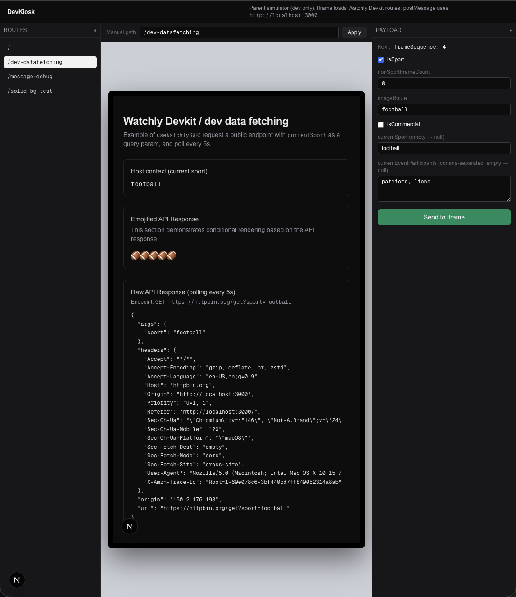

# Watchly Devkit (`watchly-devkit`)

Build your own content-aware, screen-side app for the Watchly.ai platform in 10 minutes with the devkit.<br />
Learn more about the Watchly hardware at https://watchly.ai

Watchly apps are loaded in an iframe that's hosted on the kiosk device itself and receive data from the host device
via messages (**`window.postMessage()`**) from the parent page to the iframe;
The app that you build with this devkit is intended to be the iframe content and it will be able to access all of the kiosk's image inference data through the **`WatchlyContext`**.

## Start a New project with `create-watchly-app`

```bash
npx create-next-app --example https://github.com/Common-Software-Co/watchly-devkit
cp .env.example .env.local
npm run dev
```

Open [http://localhost:3000](http://localhost:3000) (or the port shown in the terminal).

## DevKiosk (development only)

**The `/dev-kiosk` route** simulates the **parent** kiosk window that will be loading your app in production and let's you simulate context messages that deliver data to your app about what's on the adjacent TV so that your app can react to it.



- The collapsible **right** sidebar allows you to send `watchly:context` messages from the **parent** kiosk page to your app (that's loaded in the iframe).
  These are the messages that tell your app what's on the main TV so that your app can react to it.
- A collapsible **left** sidebar lists detected App Router pages (new routes will appear on-the-fly)
- The **center** shows an iframe;
- **Production:** this route returns **404** (`NODE_ENV !== 'development'`).

## How Your App Is Embedded In The "Parent" Kiosk Window

The "parent" page loads your app in an iframe and then uses `contentWindow.postMessage()` to push image inference data to your app.

```html
<iframe id="watchly" src="https://your-watchly-host.example/path" title="Watchly Devkit"></iframe>
```

Then messages are sent:

```js
const iframe = document.getElementById('watchly');
const childOrigin = 'https://your-watchly-app-host.example'; // must match iframe src origin
iframe.contentWindow.postMessage(
    {
        type: 'watchly:context',
        payload: {
            frame: {
                frameSequence: 3920,
                isSport: true,
                nonSportFrameCount: 0,
                imageRoute: '/assets/frame.png',
                isCommercial: false,
                currentSport: 'Basketball',
                currentEventParticipants: ['Team A', 'Team B'],
            },
        },
    },
    childOrigin,
);
```

The messages are received by the `watchly-devkit` framework message listener and the `WatchlyContext` is updated with the message payload.

## Parent origins (`NEXT_PUBLIC_ALLOWED_PARENT_ORIGINS`)

- Comma-separated list of **serialized origins** (scheme + host + port), e.g. `http://ui`, `http://localhost:3000`.
- **When unset or empty**, the app defaults to **`http://ui`** only (production kiosk parent hostname).
- Browsers report `event.origin` **without** a path: use **`http://ui`**, not `http://ui/`.
- If kiosks use a non-default port, include it explicitly, e.g. `http://ui:8080`.

- **`targetOrigin`** (second argument) should be the iframe’s **origin** (scheme + host + port), not `*` in production.
- The parent’s origin must appear in **`NEXT_PUBLIC_ALLOWED_PARENT_ORIGINS`** on the child so the iframe accepts the message.

## Building new content

1. Create a new child folder within `/app`. The folder name will become the url route
2. Create a file within your new folder named `page.tsx`. This is a React component definition that must `export default`.

Look at the [datafetching example](./app/dev-datafetching/page.tsx) for a minimal working component that receives Watchly context messages.

## Message shape

```ts
type WatchlyContext = {
    frame: {
        frameSequence: number;
        isSport: boolean;
        nonSportFrameCount: number;
        imageRoute: string;
        isCommercial: boolean;
        currentSport: string | null;
        currentEventParticipants: string[] | null;
    };
};
```

Invalid messages are ignored; in development, a warning is logged.

## Security behavior (iframe child)

1. **`event.origin`** must be in the allowlist.
2. When the page is embedded (`window.parent !== window`), **`event.source`** must be **`window.parent`**.

## Contributing

### Setup

```bash
git clone https://github.com/Common-Software-Co/watchly-devkit
cd watchly-devkit
npm install
cp .env.example .env.local
# Edit .env.local if your parent origin is not covered by the defaults
npm run dev
```

Open [http://localhost:3000](http://localhost:3000) (or the port shown in the terminal).

### Publishing

From `packages/create-watchly-app`, run `npm publish`.
The `prepublishOnly` script refreshes `template/` from this repo so the published tarball always matches the app sources.

Maintainers: after changing app files, run `npm run sync:create-template` so the committed template stays in sync before you ship a new CLI version.
